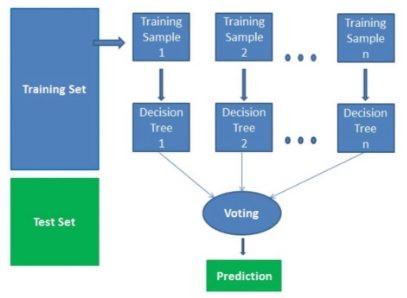
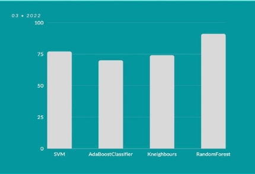
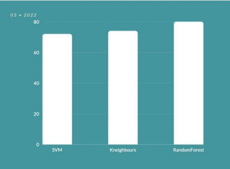
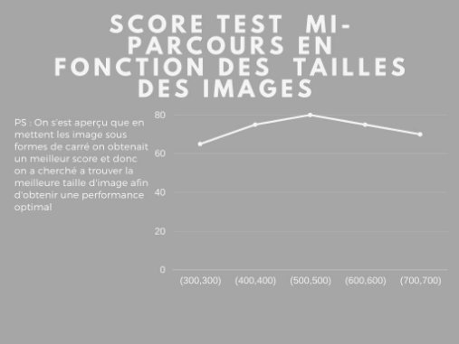
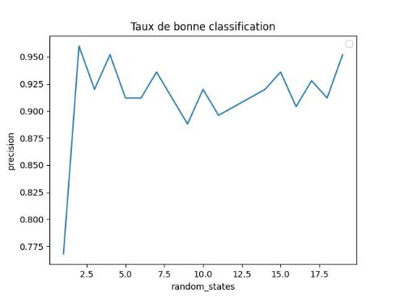



**RAPPORT UE INTRODUCTION À L’APRENTISSAGE AUTOMATIQUE **  

**Classification d’images supervisé **

***RUN 4 FUN  ***

**Walid ADDOUCHE**
**Tassadit KETTOUCHE** 

**Parcours et site : L3 informatique, Luminy** 

Meilleure score estimé par validation croisée : 96% Meilleur score obtenu sur les images tests de mi-parcours : 80.5% 

***Table des matières :***  

***Rapport UE Introduction à l’Apprentissage Automatique*** 

1. Introduction
2. Pré-traitement des données 
   1.    Représentation des données
   2. Augmentation des données
3. Algorithme(s) d’apprentissage considérés
   1. Algorithme retenu
   2. Explication de(s) algorithme(s) retenus.
   3. Alternatives
4. Evaluation des performances des classifieurs.
   1. Protocole d’estimation des performances
   2. Performances obtenues
   3. Eventuelles courbes de performance
5. Résultats obtenus
   1. Pipeline complet
   2. Alternatives
   3. Résultats et commentaires
6. Conclusion 
7. References 
8. Annexes

La classification des images consiste à répartir systématiquement des images selon des classes établies au préalable. Classer une image lui fait correspondre une classe, marquant ainsi sa parenté avec d’autres images.  

En général reconnaître une image est une tache aisée pour un humain au fil de son existence, ce qui n’est pas le cas pour une machine, mais qui est toutefois faisable avec les algorithmes de classification d’images. Dans ce projet, nous avons réalisé un modèle de classification d’images supervisé. 

En ce qui concerne l’organisation de l’équipe, Walid c’est chargé de réaliser les fonctions qui nous permettent d’obtenir l’histogramme de couleur des images de notre data set, et Tassadit a réalisé le classifier ***Random Forest*** que nous avons utilisé avec les paramètres adéquats. 

2. **Pré-traitement des données** 
1. **Représentation des données** 

Nous avons commencé le projet par répartir les catégories d’images du fichier data en  deux catégories : 

`     `**Mer -> 0** 

`    `**Ailleurs -> 1** 

Puis nous avons créé un dossier ' training ’qui contient 120 images (prises du répertoire Data), réparties comme dans le dossier ‘Data’ en deux catégories (sous-dossiers) : **Mer** et **Ailleurs**, Ce dossier nous a permis de tester nos classifier tout au long  du projet sur une petite base de données avant de le lancer sur les données ‘**Data**’. 

—> Pour la lecture, l’organisation des données (images) nous avons procédé de la sorte : 

- Lecture des données de notre répertoire contenant les données, en veillant à donner un Label représentant la catégorie d  e.      chaque image en fonction du répertoire duquel elle provient : 0 pour le répertoire Mer et 1 pour celle provenant du répertoire Ailleurs. 
- Redimensionner l’image en 500X500 
- On fait appel à la fonction **get\_rgb\_histograms(resized\_image)** en ajoutant le tableau de son résultat aplatit à l’aide de la fonction **flatten** à la liste **flat\_data :**  
- La fonction **get\_rgb\_histograms(image) :** calcule l’histogramme de la couleur rouge d’une image en faisant appel à la fonction que nous avons également défini : **cal\_hist(image).** 
- **cal\_hist(image) :** fait appel à la fonction **calcHist** de la librairie cv2 de python (opecv).** 
- Aplatir le tableau résultant de l’appel à la fonction **get\_rgb\_histograms(resized\_image)** à la liste ” **flat\_data”** qu’on utilisera par la suite  
  - Ajouter le Label de l’image lue à la liste ”target” qui 

contiendras tous les labels des   images une fois lues. 

- Construction du datafram : le tableau en lignes et colonnes représentant le contenu de **flat\_data** , c’est-à-dire,les histogrammes du rouge des images de notre data set : c’est nos X .On rajoute une colonne supplémentaire à ce datafram : **Class** qui représente la classe (catégorie) de chaque donnée , 0 pour Mer et 1 pour Ailleurs. 
2. **Augmentation des données** 

Le jeu de données d’apprentissage initial n’a pas été augmenté, cependant il a été modifié car nous avons choisis d’utiliser l’histogrammes de la couleur rouge présente sur la photo après avoir utilisé la librairie openCV pour les lire qui les rendait orange de couleur. 

Ce traitement que nous avons choisis de définir peut paraître inapproprié à première vue pour reconnaitre des images de contenant une Mer, cependant c’est le traitement qui a réalisé un taux de bonne classification le plus haut parmi tous implémentés.  

3. **Algorithme(s) d’apprentissage considérés** 

Nous avons considéré 6 classifier au fur et à mesure de l’avancement du projet avec différents traitements et paramètres : (tous pris de la librairie sklearn) 

- Classifier Gaussien pour lequel on avait eu un taux de bonne classification à 76% 
- Classifier Gaussien avec L’histogramme de couleurs avec un taux de bonne classification à 74%. 
- Classifier Gaussien avec l’histogramme des couleurs des images transformées en noir et blanc : taux de bonne classification à 63% : c’est le moins performant de tous ! 
- Classifier Gradient avec boosting : AdaBoost  et HistGradientBoostingClassifier, qui fonctionne de la sorte : Lors de la prédiction, les échantillons avec des valeurs manquantes sont affectés à l’enfant gauche ou droit en conséquence. Si aucune valeur manquante n’a été rencontré pour une caractéristique donnée pendant l’apprentissage, les échantillons avec des valeurs manquantes sont mappés à l’enfant qui a le plus d’échantillons. 
- Pour les paramètres de ce classifier, on a choisis un taux d’apprentissage de 0.5(learning\_rate=0.5) : utilisé comme facteur multiplicatif pour les valeurs des feuilles 

`      `Pour ce classifier, le taux de bonne classification était de : 78%. 

- Classifier SVM (support vector machine) : nous avons travaillé sur la réalisation d’un classifier SVM qui cherche à maximiser la marge :  
  - Paramétrage choisis : **make\_papeline(StandardScaler(), SVC(gamma=0.01, kernel=’rbf’)) :** un coefficient du noyau assez petit : **gamma =0.01**, et le type du noyeau utilisé par le noyau est **rbf.**  
  - Après avoir lancé le classifier 10 fois à l’aide de la fonction beseline(random\_state), Le meilleur taux de classification obtenu est de 82% avec un écart type de 0.02.  
- Classifier KNeighbours : nous avons travaillé sur la réalisation d’un KNeighbourClassifier (les k-plus proches voisins) avec comme paramètre le nombre de voisins mis à 50 : **n\_neighbours = 50**  
- Après avoir lancé le classifier 10 fois à l’aide de la fonction beseline(random\_state), Le meilleur taux de classification obtenu est de 82% avec un écart type de 0.02. 
1. **Algorithme retenu **

En dernier nous avons réalisé un classifier **Random Forest : (forêt aléatoire),** que nous avons décidé de garder comme classifier principal pour notre projet. 

Nous avons fait ce choix, en nous basant sur les résultats des taux de bonne classification de tous les classifier réalisés, c’est celui qui a enregistré le taux de bonne classification le plus haut, allant jusqu’à 96% pour la validation croisée. 

- Hyper-Paramètres choisis pour ce classifier : (ces hyper-paramètres seront expliqués plus en détail dans la partie 3.2 qui suit)  

Nous avons essayé plusieurs combinaisons de différents hyper-paramètres, voici ceux qui nous ont donné le taux de bonne classification le plus haut :  

- Le nombre d'arbres dans la forêt à 802, choisis arbitrairement après plusieurs essais **: n\_estimators = 802** . 
- La fonction de mesure de la qualité de la division : **criterion = ‘entropy’** (pour le gain d’information). 
- La réutilisation des solutions des appels précédents pour ajuster et ajouter plus d’estimateurs à l’ensemble avec : **warm\_start = True.** 
1. **Explication de l’algorithme retenus** 

`   `***\*\*\*\* Random Forest (Forêt aléatoire) \*\*\*\**** 

L’algorithme des forêts aléatoires, est un algorithme de classification réduit de la variance [^1] des prévisions d’un arbre de décision, améliorant ainsi les performances. 

Il combine pour cela, de multiples arbres de décisions dans une approche de type bagging[^2]. 

Cet algorithme effectue un apprentissage en parallèle sur de multiples arbres de décision construits aléatoirement et entraînés sur des sous-ensembles de données différents. 

-Fonctionnement de l’algorithme :  

- Sélectionner des échantillons aléatoires à partir d’un ensemble de données donné. 
- Construction d’un arbre de décision pour chaque échantillon, et obtenir le résultat de prédiction de chaque arbre. 
- Effectuer un vote pour chaque résultat prédit. 
- Sélectionner le résultat de la prédiction avec le plus de votes comme prédiction finale. 

`  `*Figure 1- Fonctionnement de l'algorithme Random Forest *

Dans ce projet, nous avons choisi les hyper-paramètres suivants :  

- **n\_estimators  :** c’est le nombre d’arbres que l’on souhaite construire avant de prendre le vote maximum, un nombre plus élevé d’arborescences donne de meilleurs performances, mais cependant ralenti le code. Ici, on a choisis un nombre d’arbres égal à 802 car lors de l’exécution de la fonction **baseline(random\_state)** que nous avons implémenté : elle effectue l’entrainement du modèle commençant l’arbre par un **random\_state** donné, nous avons remarqué que pour  

random\_state = 2 et n\_estimators = 802 nous avons le taux de classification le plus élevé : 96%; 

Cela s’explique par le fait que notre data set n’est pas ‘très grand’ (comparé au data sets utilisés dans les entreprises par exemple) et 802 arbres de décisions pour ce data set donne un assez bon résultat. 

- **criterion :** fonction utilisé pour mesurer la qualité d’une division, ici nous avons opté pour ‘entropy’ pour le gain d’information.** 
- **warm\_start** : quand il est à True, permet au classifier de réutiliser des aspects du modèle appris à partir de la valeur de paramètre précédente, ce qui permet de gagner du temps lors de l’exécution lors d’un appel à la fonction fit.** 
3. **Alternatives** 

Nous avons utilisé plusieurs autres algorithmes de classification, cités au début de la partie 3 (Algorithmes d’apprentissages considérés) ainsi que  d’autres descripteurs , cependant nous ne les avons pas retenus car par exemple transformer les images en noir et blanc réduit le taux de précision ainsi que le taux de bonne classification : ils ne sont pas adéquats aux données dont nous disposons. 

4. **Évaluation des performances des classifieurs **
1. **Protocole d’estimation des performances**  

Différentes approches ont été utilisées pendant l’élaboration de ce projet la catégorisation d’une image offrant ainsi, aux développeurs dans le domaine plusieurs issues, qui amène à poser une question très récurrente sur le choix du meilleur algorithme pour la classification automatique de images. 

Pour pouvoir répondre à cette question, il faut bien disposer de critères et tests utiles pour mesurer et évaluer les performances d’un classifieur pour pouvoir les comparer par la suite, afin, éventuellement, opter pour un classifieur ou un autre.  

Mais qu’est-ce que l’évaluation ? L’évaluation consiste à mesurer la différence entre un résultat attendu et un résultat obtenu. Aucune métrique n’est associée, mais en général, on utilise des indicateurs compris entre 0 et 1 dans notre cas on a voulu être plus original on a utilisé le 1 et le -1 (qui catégorise le 0 lui aussi) pour en faciliter l’interprétation. 

Néanmoins, l’évaluation des performances d’un système de classification n’est pas toujours triviale et elle dépend de l’utilisation finale de ce système, certains éléments sont très subjectifs et difficilement automatisables.  

2. **Performances obtenues**  

`           `Notons qu’il n’est pas facile de juger un système de catégorisation d’images s’il est performant ou moins performant qu’un autre. Plusieurs facteurs entrent en jeu qui rendent cette évaluation relative, de la base d’images à classer, de l’approche adoptée pour représenter les données, de l’algorithme d’apprentissage opérée, et enfin du juge humain puisque l’attribution finale d’un document à une classe dépend du centre d’intérêt des utilisateurs de ses systèmes. 

Néanmoins, Après avoir Tester différents Types d’algorithmes de classification on a calculé la moyenne des scores de la validation croisé pour chaque algorithme et on a obtenu les scores suivants   
 on a essayé d’autre algorithme de classification (HistGradientBoostingClassifier, AdaBoostClassifier, GradientBoostingClassifier, GaussianNB) mais vu les scores assez médiocres obtenus et la documentation de ces classifier qui était plutôt abstraite par rapport à notre niveau (Étudiants en informatique avec un assez faible background en mathématique)  

*Figure 2- Moyenne des scores de la validation croisée des classifieurs réalisés *

On s’est donné objectif au fil de quelques semaines d’essayer de trouver les bons paramètres afin d’améliorer le score final et de trouver les meilleurs processus de traitement sur les données afin de booster notre score final (Test mi-parcours) et ce sur les 3 algorithmes qui avaient les meilleurs score dès le début (SVM, KNeighbors, RandomForest)  sur les 3 classifieurs on a fait le même process sur la Data (redimensionner les images en 500x500 , utiliser l’histogramme du rouge de chaque images) et en jouant sur les paramètres des 3 classifieurs  on a réussi à avoir les paramètres de chaque classifier avec lequel il retourne le meilleur score comme le montre la figure ci-dessous. 

*Figure 3-Classifieurs qui réalisent le meilleur taux de classification (mi-parcours) *

` `On note bien que la différence entre le score de la mi-parcours et de la validation croisé des deux premiers algorithmes de classification (SVM, Kneighbours) est insignifiante de l’ordre de 2 % mais celle du RandomForest qui retourne un score excellent lors de la première phase du Test (validation croisée) 96% mais on retombe a 80% lors du test de mi-parcours chose qui est dû au fait que les images de test provenant di dossier ‘AllTest’ contient des caractéristiques différentes de celles considérées lors de l’apprentissage.

3. **-Éventuelles courbes de performances** 

*Figure 4- Taux de bonne classification des images de test mi-parcours en fonction de leurs tailles*

Néanmoins le score par validation croisé ne croit pas énormément en modifiant la tailles des images traités et cela est dû à notre avis au type d’images qu’on a en notre possession afin de faire le test de mi- parcours.  

En effet ces images sont des images de paysage certes mais les détails de ces images sont à  notre avis un peu éloigné des images avec lesquelles  notre  classifieur s’est entrainé  et donc la marge d’erreur croit à chaque fois qu’on s’éloigne de la moyenne des tailles des image d’entrainement. 

5. **Résultats obtenus** 
1. **Pipeline complet** 

Nous avons implémenté une fonction nommée **baseline(state)** qui se charge de lancer l’entrainement du modèle avec un **random\_state = state,** et renvoie les valeurs suivantes : x\_train , x\_test, y\_train, y\_test et accuracy\_score(y\_test, y\_predict). 

L’entrainement est réalisé de la sorte :  

9 

def baseline(state): 

`    `x\_train,x\_test,y\_train,y\_test = train\_test\_split(x,y,shuffle=True,test\_size = 0.3,random\_state=state,stratify=y)   

classifieur.fit(x\_train,y\_train) classifieur.n\_estimators += 1;  y\_predits = classifieur.predict(x\_test) 

return x\_train,x\_test,y\_train,y\_test,accuracy\_score(y\_test,y\_predits) 

On fait appel à la fonction **train\_test\_split** de la librairie **sklearn** , avec les paramètres suivants :  

- **Shuffle = True** : qui permet de mélanger les données avant de les diviser : on choisit d’avoir les données prises aléatoirement pour un meilleur taux d’apprentissage. 
- **Test\_size = 0**.3 : on laisse 30% des données pour le test. 
- **Random\_state = state :** permet de fixer la manière dont les données sont divisées, par conséquent, pour reproduire un même modèle, le meilleur en l’occurrence ici** à chaque fois qu’on exécute notre code et obtenir la même répartition des données. 

Afin de connaitre les meilleur réglages (paramétrages) , on a fait appel à cette fonction 20 fois et on sauvegarde  le taux de bonne classification : accuracy\_score(y\_test, y\_predict) à chaque appel de fonction dans un fichier texte nommée **scoresRForest.txt ,** 

L’appel ce fait de la façon suivante :  

for i in range(1,20): 

`    `x\_train,x\_test,y\_train,y\_test,accuracy= baseline(i)     f = open('scoresRForests.txt','a+') 

`    `f.write(str(accuracy)+"\n") 

Avec les résultats sauvegardés dans notre fichier texte **scoresRForest.txt,** on produit le graphe suivant qui nous permet de mieux visualiser les résultats : 

1 0 

*Figure 5-Taux de bonne classification de notre modèle en fonction des states*

On a constaté que le state qui nous donne le meilleur taux de bonne classification est le state 2, pour lequel il monte jusqu’à 96%. 

Une fois ce meilleur paramétrage enregistré, on sauvegarde notre modèle en un fichier binaire en utilisant **pickle** sous le nom de **image\_classification\_scoresRForest.py** 

Auquel on fera appel pour tester de nouvelles images à classifier hors notre data set. 

2. **Alternatives** 

Lors de la réalisation des autres classifiers, on a également sauvegardé tous les modèles dans des fichier binaires en utilisant **pickle**, ce qui nous a permis de garder une trace de notre travail et de l’améliorer au fur et à mesure. 

3. **Résultats et commentaires** 

Comme cité précédemment, nous avons enregistré notre classifier avec un taux de bonne classification de 96%, qui est plus élevé que ceux des modèles réalisés à mi-parcours. 

Au regard des intuitions et documentations réalisées, nous nous attendions à un meilleur score sur les images testes de mi-parcours qui est à 80.5% comparé au 96% de la validation croisée, mais qui reste quand même raisonnable comparé au type d’images testés qui ont des caractéristiques assez différentes de celles de l’entraînement de notre modèle. 

6. **Conclusion **

L’objectif de ce projet était de découvrir le B.A.BA de l’apprentissage automatique à travers l’expérience de la classification binaire, tout en réalisant soi-même l’importance des concepts fondamentaux de l’apprentissage notamment les mesures de performances, généralisations, l’importance des échantillons, la notion d’hyper-paramètres. 

Nous nous sommes attachés à mettre au point un modèle de reconnaissance d’images contenant une Mer rapide et fiable. 

Pour cela nous avons dans un premier temps choisi une représentation de nos données image, avec pour objectif qu’elle soit suffisamment informative. 

Nous avons testé plusieurs classifiers avec plusieurs traitements sur les images en fonction de ces derniers au fur et à mesure de leur présentation en cours, les plus populaires : méthodes de boosting avec un algorithme de type AdaBoost , méthodes à noyau avec SVM (Support Vector Machines) ainsi que la méthode des forêts aléatoire. Après avoir testé le classifier de Forêts Aléatoires ou Random Forests dans son terme classique en Anglais, nous avons obtenu un classifier plus performant en terme de taux de bonne classification. 

Toutes les méthodes citées ont été implémentées pour être testées et validées, de nombreuses combinaisons ont été expérimentées en interchangeant les classifieurs ce qui nous a permis de mettre en évidence certains faits.  

Parmi les problèmes que nous tenons à souligner, le fait que la base d’entraînement de nos classifieur ne regroupe pas toutes les caractéristiques représentant la Mer, en particulier des images nocturnes et satellites.  

Des améliorations pourraient certainement apportées en utilisant des descripteurs plus performants que l’histogramme de couleurs ou en entraînant des classifieurs sur bases d’apprentissage plus grandes avec plus de caractéristiques, en tenant en compte le fait de paralléliser les tâches de calcul afin de diminuer le temps de calcul.  

**Références **

- Présentation des classifieurs : *cours* L3 Informatique – UFR Sciences Introduction à l’Apprentissage Automatique 

Présenté par : Cecile Capponi QARMA,  

`     `Universite d’Aix-Marseille 

- Fonction train\_test\_split :   [https://scikit- learn.org/stable/modules/generated/sklearn.model_selection.train_test_split.html ](https://scikit-learn.org/stable/modules/generated/sklearn.model_selection.train_test_split.html)
- Matplotlib pour les figures :[ https://matplotlib.org/* ](https://matplotlib.org/)
- Numpy pour l’affichage des images et des figures :[ https://numpy.org/doc/stable/ ](https://numpy.org/doc/stable/)
- Construction du tableau pour la visualisation des données : [https://pandas.pydata.org/docs/reference/api/pandas.DataFrame.html ](https://pandas.pydata.org/docs/reference/api/pandas.DataFrame.html)
- Traitement des images. :[ https://opencv.org/ ](https://opencv.org/)
- Tous les classifieurs réalisés proviennent de la librairie :[* https://scikit-learn.org/stable/ ](https://scikit-learn.org/stable/)

**Annexes :  **

- Figure 1 : Fonctionnement de l'algorithme Random Forest : la figure permet de résultats le fonctionnement de l’algorithme des forêts aléatoires. 
- Figure 2 : Moyenne des scores de la validation croisée des classifieurs réalisés :  

`        `La figure a été réalisée afin de bien représenter les moyennes des scores obtenus par validation     croisée des classifieurs étudiés lors de la réalisation ce projet. 

- Figure 3 :*** Classifieurs qui réalisent le meilleur taux de classification (mi-parcours) :  

Cette figure a été réalisé à mi-parcours ; elle représente les taux de classification des classifieurs que nous avons choisi de garder et d’exploiter plus par la suite. 

- Figure 4 : Taux de bonne classification des images de test mi-parcours en fonction de leurs tailles :                      La figure a été réalisé à mi-parcours ; elle représente le taux de bonne classification des images du répertoire **‘AllTest’** fournis par notre enseignante à mi-parcours. Cette figure nous permis de démontrer que la meilleur taille à donner à nos images est bien 500X500. 
- Figure 5 : Taux de bonne classification de notre modèle en fonction des states :  

La figure a été réalisé à partir des données récupérées de l’entraînement de notre modèle en utilisant le classifieur de Forêts Aléatoires  en fonction du random\_state donné à la fonction qui réalise l’entrainement : elle nous a permis de cibler l’état qui sonne le taux de bonne classification le plus élevé. 
4 4 

[^1]: ` `**La variance** : est une erreur utilisée pour définir la qualité d’un algorithme. 
[^2]: ` `**Bagging** : contraction de Boosting Aggregation, c’est une technique utilisée pour améliorer la classification, notamment celle des arbres de décisions. 